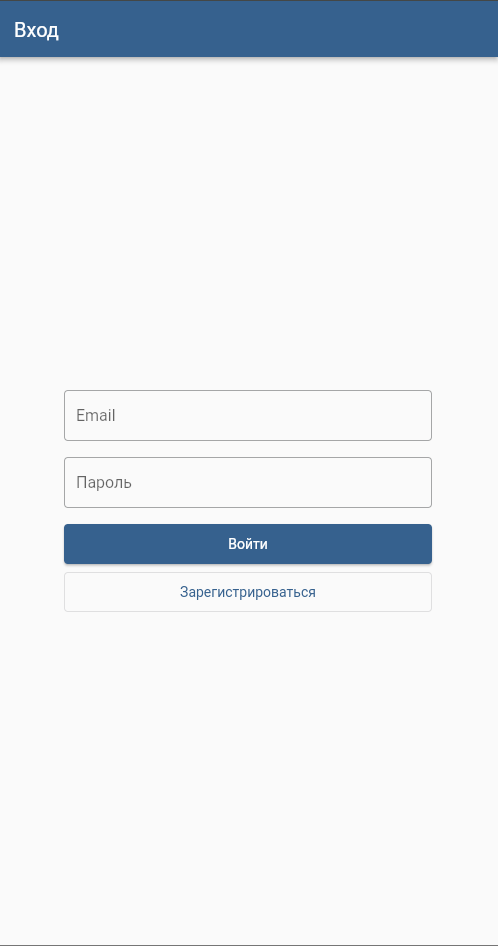

# Flutter Auth App

Простое одностраничное Flutter-приложение с авторизацией, содержащее экран входа и экран приветствия.

## Возможности

- **Экран входа**:
  - Поля ввода email и пароля с валидацией
  - Проверка корректного формата email
  - Минимальная длина пароля 6 символов
  - Имитация входа с индикатором прогресса (1.5 секунды)
  - Отображение ошибки при неправильных учетных данных
  - Кнопка "Зарегистрироваться" (заглушка реализации)

- **Экран приветствия**:
  - Персонализированное приветственное сообщение с email пользователя
  - Кнопка "Выйти" для возврата к экрану входа

- **Логика авторизации**:
  - Правильные учетные данные: `test@test.com` / `qwerty123`
  - Неправильные данные покажут сообщение об ошибке

- **Дизайн UI**:
  - Адаптивный layout (работает на разных размерах экранов)
  - Чистый и простой стиль Material Design
  - Без компонентов Material 3 (по требованиям)
  - Центрированное содержимое с максимальной шириной 400px

## Скриншоты

### Экран приветствия


### Экран входа (пустые поля)


### Экран входа (с ошибками валидации)


## Начало работы

### Предварительные требования

- Установленный Flutter SDK
- Dart SDK
- Подходящая IDE (VS Code, Android Studio и т.д.)

### Запуск приложения

1. Клонируйте репозиторий:
   ```bash
   git clone https://github.com/Zakirov-Yuriy/Flutter-Auth-App.git
   cd flutter_auth_app
   ```

2. Установите зависимости:
   ```bash
   flutter pub get
   ```

3. Запустите приложение:
   ```bash
   flutter run
   ```

Или используйте функции запуска/отладки вашей IDE.

### Структура проекта

```
lib/
├── screens/
│   ├── login_screen.dart    # Экран входа с валидацией формы
│   └── welcome_screen.dart  # Экран приветствия после успешного входа
└── main.dart                # Точка входа приложения с управлением состоянием

# Платформо-специфический код в android/, ios/, web/, windows/, etc.
```

## Технические детали

- **Управление состоянием**: setState (простой и достаточный для данного случая)
- **Валидация**: Flutter Form с кастомными валидаторами
- **Навигация**: Условная отрисовка экранов
- **Адаптивный дизайн**: ConstrainedBox и гибкие layouts
- **Тема**: Кастомная Material тема без Material 3

## Соответствие требованиям

- ✅ **Экран авторизации** с полями Email и Пароль
- ✅ **Валидация**: корректный email и пароль минимум 6 символов
- ✅ **Отображение ошибок** под полями ввода
- ✅ **Кнопка "Войти"** с CircularProgressIndicator (1.5 сек)
- ✅ **Кнопка "Зарегистрироваться"** (заглушка)
- ✅ **Успешная авторизация** с test@test.com / qwerty123
- ✅ **Ошибка авторизации** с сообщением "Неверный логин или пароль"
- ✅ **Экран приветствия** с персональным сообщением
- ✅ **Кнопка "Выйти"** для возврата к экрану входа
- ✅ **Адаптивный дизайн** для разных размеров экранов
- ✅ **Стандартные Flutter-виджеты** без Material 3
- ✅ **Управление состоянием** через setState
- ✅ **Читаемость и структурированность** кода
- ✅ **Разделение по папкам**: screens/, widgets/

## Лицензия

Этот проект создан в образовательных целях.

---

Более подробную информацию о Flutter можно найти в [официальной документации Flutter](https://docs.flutter.dev/).
